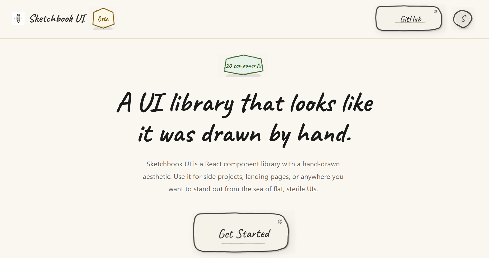

# Sketchbook UI

A hand-drawn React component library with a sketchy, notebook aesthetic. 20 fully typed components with wobbly borders, paper textures, and pencil-line details, for side projects, landing pages, or anywhere you want to stand out.



## Features

- 20 components (Button, Input, Modal, Accordion, Toast, etc.)
- Hand-drawn SVG borders, paper textures, and subtle animations
- Fully typed with TypeScript
- Themeable via `colors` and `typography` props on every component
- Zero runtime dependencies beyond React
- Tree-shakeable, under 70 kB gzipped

## Documentation

Browse all components and their variants in the [Storybook docs](https://sarthakrawat-1.github.io/sketchbook-ui/docs/).

## Quick Start

Copy the `src/components/` and `src/lib/` directories into your project along with `src/styles/globals.css`. Then import and use:

```tsx
import { Button, Input, SketchCard } from "./components";

function App() {
  return (
    <SketchCard>
      <Input label="Name" placeholder="Type here..." />
      <Button>Submit</Button>
    </SketchCard>
  );
}
```

## Contributing

Please read the [contributing guide](/CONTRIBUTING.md).

## License

Licensed under the [MIT license](./LICENSE.md).